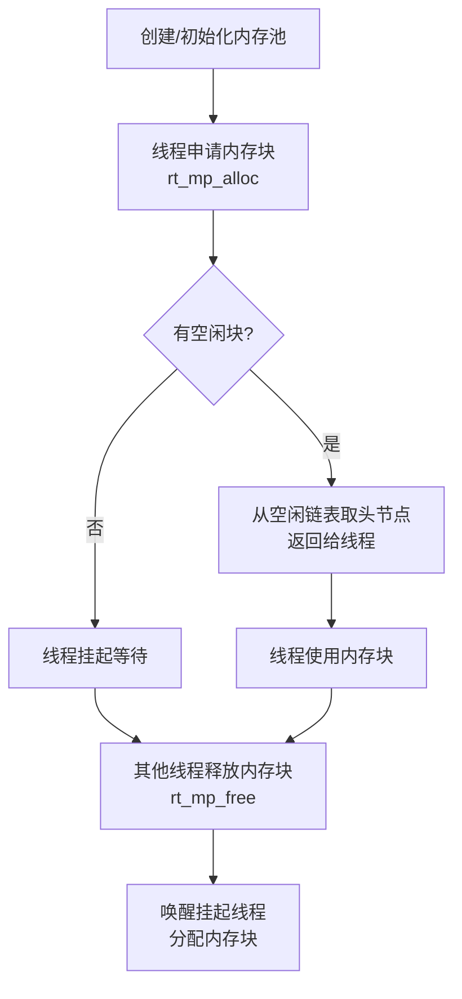

# 1 RTT的内存管理

由于实时系统中对时间的要求非常严格，内存管理往往要比通用操作系统要求苛刻得多：
1. 分配内存的时间必须是确定的
2. 随着内存不断被分配和释放，整个内存区域会产生越来越多的碎片
3. 选择适合的高效率的内存分配算法

RTT提供以下三种内存管理方法（MCU开发主要使用的是小内存管理法）：
1. 针对小内存块的分配管理（小内存管理算法）
2. 针对大内存块的分配管理（slab 管理算法）
3. 针对多内存堆的分配情况（memheap 管理算法）

> 因为内存堆管理器要满足多线程情况下的安全分配，会考虑多线程间的互斥问题，所以请不要在中断服务例程中分配或释放动态内存块。因为它可能会引起当前上下文被挂起等待。
## 1.1 小内存管理算法
小内存管理算法是一个简单的内存分配算法。初始时，它是一块大的内存。当需要分配内存块时，将从这个大的内存块上分割出相匹配的内存块，然后把分割出来的空闲内存块还回给堆管理系统中。每个内存块都包含一个管理用的数据头，通过这个头把使用块与空闲块用双向链表的方式链接起来。
![[Pasted image 20260811224721.png]]
1. magic：幻数，初始化位heap（对应的ASCII），标记这是一个内存管理的内存数据块。
2. used：指出当前内存是否被分配

**4.10实现如下**

![[Pasted image 20260812000212.png]]

- **堆总管**：记录整片堆的起始地址、结束地址、`lfree`（首个空闲块指针）、最小空闲地址和总大小。
- **内存块**：每块（无论已分配或空闲）都有 12 字节管理头，包含 `magic`（幻数）、`pool_ptr`（指向堆总管，且最低位偷作标记：`1`=已分配，`0`=空闲）、链表前后指针。返回给用户的是跳过管理头的地址。
- **分配**：从 `lfree` 沿链表找足够大的空闲块 → 若远大于需求则切分 → 剩余块放回链表，`lfree` 更新。
- **释放**：标记为空闲，检查前后邻居是否空闲，是则合并为一块大内存。

![[Pasted image 20260812000239.png]]
![[Pasted image 20260812000245.png]]

## 1.2 slab管理算法

RT-Thread 的 slab 分配器实现主要是去掉了其中的对象构造及析构过程，只保留了纯粹的缓冲型的内存池算法。slab 分配器会根据对象的大小分成多个区（zone），也可以看成每类对象有一个内存池。

![[Pasted image 20260812000254.png]]

系统中的 zone 最多包括 72 种对象，一次最大能够分配 16K 的内存空间，如果超出了 16K 那么直接从页分配器中分配。每个 zone 上分配的内存块大小是固定的，能够分配相同大小内存块的 zone 会链接在一个链表中，而 72 种对象的 zone 链表则放在一个数组（zone_array[]）中统一管理。
#### 1 内存分配
假设分配一个 32 字节的内存，slab 内存分配器会先按照 32 字节的值，从 zone array 链表表头数组中找到相应的 zone 链表。如果这个链表是空的，则向页分配器分配一个新的 zone，然后从 zone 中返回第一个空闲内存块。如果链表非空，则这个 zone 链表中的第一个 zone 节点必然有空闲块存在（否则它就不应该放在这个链表中），那么就取相应的空闲块。如果分配完成后，zone 中所有空闲内存块都使用完毕，那么分配器需要把这个 zone 节点从链表中删除。
#### 2 内存释放
分配器需要找到内存块所在的 zone 节点，然后把内存块链接到 zone 的空闲内存块链表中。如果此时 zone 的空闲链表指示出 zone 的所有内存块都已经释放，即 zone 是完全空闲的，那么当 zone 链表中全空闲 zone 达到一定数目后，系统就会把这个全空闲的 zone 释放到页面分配器中去。

# 2 内存池
内存池是一种内存分配方式，用于分配大量大小相同的小内存块，它可以极大地加快内存分配与释放的速度，且能尽量避免内存碎片化。此外，RT-Thread 的内存池支持线程挂起功能，当内存池中无空闲内存块时，申请线程会被挂起，直到内存池中有新的可用内存块，再将挂起的申请线程唤醒。
![[Pasted image 20260812000337.png]]
> 内存池的线程挂起功能非常适合需要通过内存资源进行同步的场景。例如播放器会对音乐文件进行解码，然后发送到声卡驱动，从而驱动硬件播放音乐。 

## 2.1 内存池工作机制
#### 1）内存池控制块
操作系统用于管理内存池的一个数据结构。
```C
struct rt_mempool
{
    struct rt_object parent;

    void        *start_address;  /* 内存池数据区域开始地址 */
    rt_size_t     size;           /* 内存池数据区域大小 */

    rt_size_t     block_size;    /* 内存块大小  */
    rt_uint8_t    *block_list;   /* 内存块列表  */

    /* 内存池数据区域中能够容纳的最大内存块数  */
    rt_size_t     block_total_count;
    /* 内存池中空闲的内存块数  */
    rt_size_t     block_free_count;
    /* 因为内存块不可用而挂起的线程列表 */
    rt_list_t     suspend_thread;
    /* 因为内存块不可用而挂起的线程数 */
    rt_size_t     suspend_thread_count;
};
typedef struct rt_mempool* rt_mp_t;

```
#### 2）内存池工作机制
内存池在创建时先向系统申请一大块内存，然后分成同样大小的多个小内存块，小内存块直接通过链表连接起来（此链表也称为空闲链表）。每次分配的时候，从空闲链表中取出链头上第一个内存块，提供给申请者。从下图中可以看到，物理内存中允许存在多个大小不同的内存池，每一个内存池又由多个空闲内存块组成，内核用它们来进行内存管理。当一个内存池对象被创建时，内存池对象就被分配给了一个内存池控制块，内存控制块的参数包括内存池名，内存缓冲区，内存块大小，块数以及一个等待线程队列。
![[Pasted image 20260812000418.png]]
内核负责给内存池分配内存池控制块，它同时也接收用户线程的分配内存块申请，当获得这些信息后，内核就可以从内存池中为内存池分配内存。内存池一旦初始化完成，内部的内存块大小将不能再做调整。
1. 创建和删除
    创建内存池操作将会创建一个内存池对象并从堆上分配一个内存池。创建内存池是从对应内存池中分配和释放内存块的先决条件，创建内存池后，线程便可以从内存池中执行申请、释放等操作
    ```
    rt_mp_t rt_mp_create(const char* name,
                         rt_size_t block_count,
                         rt_size_t block_size);

    ```
    创建内存池时，需要给内存池指定一个名称。然后内核从系统中申请一个内存池对象，然后从内存堆中分配一块由块数目和块大小计算得来的内存缓冲区，接着初始化内存池对象，并将申请成功的内存缓冲区组织成可用于分配的空闲块链表
    删除内存池将删除内存池对象并释放申请的内存。使用下面的函数接口：
    ```
    rt_err_t rt_mp_delete(rt_mp_t mp);
    ```
    删除内存池时，会首先唤醒等待在该内存池对象上的所有线程（返回 -RT_ERROR），然后再释放已从内存堆上分配的内存池数据存放区域，然后删除内存池对象。
2. 初始化和脱离内存
    初始化内存池跟创建内存池类似，只是初始化内存池用于静态内存管理模式，内存池控制块来源于用户在系统中申请的静态对象。另外与创建内存池不同的是，此处内存池对象所使用的内存空间是由用户指定的一个缓冲区空间，用户把缓冲区的指针传递给内存池控制块。
    ```
    rt_err_t rt_mp_init(rt_mp_t mp,
                        const char* name,
                        void *start, rt_size_t size,
                        rt_size_t block_size);
    ```
    初始化内存池时，把需要进行初始化的内存池对象传递给内核，同时需要传递的还有内存池用到的内存空间，以及内存池管理的内存块数目和块大小，并且给内存池指定一个名称。
    脱离内存池将把内存池对象从内核对象管理器中脱离。
    ```
    rt_err_t rt_mp_detach(rt_mp_t mp);
    ```
3. 释放和分配内存块
    从指定的内存池中分配一个内存块
    ```
    void *rt_mp_alloc (rt_mp_t mp, rt_int32_t time);
    ```
    任何内存块使用完后都必须被释放，否则会造成内存泄露，释放内存块使用如下接口
    ``` C
    void rt_mp_free (void *block);
    ```

## 2.2 内存池使用流程



**步骤说明：**

1. **创建内存池**：通过 `rt_mp_create` 从堆上分配一块大内存，按 `block_size` 切分为 `block_count` 个等大小内存块，串成空闲链表。
2. **申请内存块**：线程调用 `rt_mp_alloc` 从空闲链表取链表头第一个空闲块。若链表为空，线程挂起到 `suspend_thread` 队列上等待。
3. **释放内存块**：用完调用 `rt_mp_free` 归还内存块，将其重新链入空闲链表。若有挂起线程，唤醒队首线程并将该块分配给它。
4. **删除/脱离**：不再使用时调用 `rt_mp_delete`（动态）或 `rt_mp_detach`（静态）回收资源。

